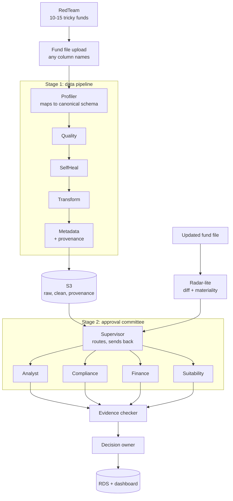

# FundSentinel: Full Plan

Sep 22, 2026 · @andwemet

## 1. What we're building

Messy fund data goes in, AI agents clean and map it by themselves, an AI committee judges each fund using real proof, and a final decision comes out with a clear reason. When a fund's data changes later, only the affected reviews reopen. The whole line runs without ever stopping for a human.

This is our entry for the TIAA x ASU AI Investment Spark Challenge: an agent-run approval pipeline for mutual funds and ETFs, built on mock scenarios and public or synthetic data.

### The merged plan

We kept FundSentinel as the base because it covers the whole problem statement, and borrowed the strongest parts of the two other team ideas.

| Source idea | What we took | What we left out |
| --- | --- | --- |
| FundSentinel | Full two-stage pipeline, Supervisor with send-back, Evidence checker, SelfHeal, insight dashboard | PolicyPilot (not in the rubric, hard to make reliable) |
| FundProof | Canonical schema, AI mappings with confidence checked by code, raw + normalised values, field-level provenance | Multi-format intake (JSON, documents); CSV only |
| Change Radar | Radar-lite: updated file reopens only the affected reviewers, old evidence marked stale | Pausing for human clarification |
| All three | Run IDs, safe re-runs, acceptance checklist, numbers and hard rules in code |  |

**One rule for everything:** nothing pauses the pipeline. Human review is always a flag, never a stop.

## 2. System flow

The pipeline has two stages, a data team and an approval committee, plus Radar-lite for later changes.

The Supervisor can send a fund back when reviewers disagree. The Evidence checker sends back any verdict without proof. Radar-lite tells the Supervisor which reviewers to reopen when a fund's data changes.

| Colour group | Agents | Job |
| --- | --- | --- |
| Data agents | Profiler, Quality, SelfHeal, Transform, Metadata | Map, clean, and label the data |
| Decision agents | Supervisor, 4 reviewers, Evidence checker, Decision owner, Radar-lite materiality | Judge each fund and re-judge changes |
| Control agent | RedTeam | Test the system |
| Storage and screens | Upload, S3, RDS, dashboard | Hold data and show results |

## 3. One fund's journey (example: Green Energy ETF)

Green Energy ETF gets mapped, cleaned, reviewed by four agents, checked for proof, and approved; later its fee rises and only the affected reviews reopen.

**Step 1: Upload.** We upload a fund file, for example from Kaggle. Green Energy ETF shows: fee 0.60%, returns 11% over 5 years, risk Medium, category "Equty" (a typo). The system works with any fund file, even one with different column names.

**RedTeam (side box).** Before the file goes in, a "hacker" agent secretly adds 10 to 15 realistic tricky funds: a hidden 5% fee, made-up 90% returns, a "Low risk" label on a very risky fund, a fee written as "75 bps". At the end we count how many tricks were caught.

**Step 2: Stage 1, the data team.** Five agents run one after another:

- **Profiler (reader and mapper):** understands the file and maps each column to our canonical schema with a confidence score, e.g. "annual\_expense = expense ratio, 95% sure". Code then checks every mapping (type, unit, range) before it is accepted.
- **Quality (inspector):** finds typos ("Equty"), impossible values (a 45% fee), missing info, duplicates, and bad dates.
- **SelfHeal (repairer):** fixes problems without ever stopping the line (see the table below).
- **Transform (organiser):** makes data consistent ("75 bps" and "0.75%" both become 0.0075) and adds useful columns, like fee compared to category average. It also suggests new useful columns by itself, which the slides reward.
- **Metadata (labeller):** writes a plain description of every column and field-level provenance: raw value, normalised value, source row, and what changed it.

| How sure? | What SelfHeal does | Example |
| --- | --- | --- |
| Very sure | Fixes it and logs the change | "Equty" becomes "Equity" (98% sure) |
| Not fully sure | Uses best guess, marks "needs review", moves on | Fee "7.5" becomes 0.75%, flagged |
| Too broken | Sets that fund aside with a reason; others continue | No fee at all: "Cannot check: fee missing" |

**Canonical schema (core fields):** fund\_id, fund\_name, ticker, category, benchmark, expense\_ratio, risk\_score, returns, as\_of\_date, source\_ref.

**Step 3: S3.** Raw data, clean data, labels, provenance, and the fix log are saved in S3, the shared cupboard every part of the system takes from. Each run gets a run ID, so a re-run never creates duplicates.

**Step 4: Stage 2, the approval committee.**

- **Supervisor (panel chair):** decides who checks what and in which order. If reviewers disagree on real, conflicting evidence, it sends the fund back. It chooses by itself and does not follow a script.
- **Policy config:** the mock rules (e.g. max fee 0.75%) live in a simple config file that reviewers read.

| Reviewer | Checks | Green Energy ETF |
| --- | --- | --- |
| Analyst | Performance | Pass: 11% average returns is good |
| Compliance | Rule breaks | Pass: no rules broken |
| Finance | Fees | Pass: 0.60%, under the 0.75% limit |
| Suitability | Investor fit | Pass: medium risk, fine for most investors |

**Step 5: Evidence checker.** "Show your work." Every verdict must point to real numbers and their provenance. A verdict without proof is sent back.

**Step 6: Decision owner.** It decides in two layers:

- **Layer 1, fixed rules in code:** Compliance fail means always reject. Missing evidence means send back.
- **Layer 2, AI thinking:** chooses Approved, Approved with conditions, Rejected, or Flagged for human review. The flag is just a label; the line keeps moving.

Results: Green Energy ETF is **Approved** ("good returns, low fee, no rules broken"). RedTeam's 5%-fee fund is **Rejected**, so the trick was caught.

**Step 7: Radar-lite, a later change.** A month later an updated file arrives. For Green Energy ETF, the price date changed (routine), the fee rose from 0.60% to 1.10%, and the benchmark changed.

- Code compares the old and new versions and lists every change.
- The Radar-lite agent classifies each change: the date update is routine, the fee rise is material, the benchmark change affects performance and suitability.
- The Supervisor reopens only Finance, Analyst, Suitability, and the Decision owner. Compliance is skipped because nothing it checks changed.
- Old fee and benchmark evidence is marked stale. New evidence records the old value, new value, rule, and route.
- New result: **Rejected** (fee now above the 0.75% limit), with a before-and-after evidence packet.

**Step 8: RDS + dashboard.** RDS permanently stores every decision, reason, fix, flag, and review event. The dashboard shows:

- approvals and rejections with reasons (click any fund for its full story and provenance)
- mappings with confidence, fixes made, and items flagged for review
- re-reviews: which reviewers reopened, which were skipped, and why
- bottlenecks, e.g. "most funds stuck at Compliance"
- the RedTeam score, e.g. "caught 13 of 15"
- time saved

## 4. Tech choices

We build with Strands on AgentCore in us-east-1, using only Claude Opus 5, Claude Sonnet 5, and Titan Text Embeddings V2.

### Rules from the organisers' guide

- Work only in **us-east-1 (N. Virginia)**. Nothing works in other regions.
- Only 3 models are allowed: **Claude Opus 5, Claude Sonnet 5, Titan Text Embeddings V2**. Any other model returns "explicit deny".
- Code goes in **CodeCommit**. Push often.
- Access keys come from the SSO portal and expire; re-copy them when commands start failing.

### Strands vs LangGraph

Both are allowed. The kickoff slide lists "AWS Bedrock Agents or LangGraph/Strands on Bedrock". The getting-started guide says TIAA deploys agents with AgentCore (not Bedrock Agents), and its walkthrough uses Strands.

|  | Strands | LangGraph |
| --- | --- | --- |
| What it is | Amazon's simple Python library for agents | Library where the agent flow is drawn as a graph |
| Fit with the guide | Exact match; the AgentCore wizard sets it up | Allowed, but not walked through in the guide |
| How the Supervisor works | Other agents become its tools; it picks which to call | Boxes and arrows; the AI picks which arrow to follow |
| Loops and send-backs | Possible; the AI decides | Very clear and easy to control |
| Organiser support | Knows this path | Less likely |
| Learning effort | Easier | A bit more |

**Decision: Strands**, unless a teammate already knows LangGraph well. If we pick LangGraph, confirm in Slack that it deploys to AgentCore. Pick one and don't switch mid-hackathon.

### Which model does what

| Model | Used for | Why |
| --- | --- | --- |
| Claude Sonnet 5 | Profiler (mapping), Quality, SelfHeal, Transform, Metadata, Analyst, Finance, Suitability, RedTeam, all testing | Fast and good enough for focused jobs |
| Claude Opus 5 | Supervisor, Compliance, Evidence checker, Decision owner (Layer 2), Radar-lite materiality | Hardest thinking: routing, disagreements, what counts as material, final calls |
| Titan Embeddings V2 | Matching unknown column names to the canonical schema ("exp\_ratio\_pct" to expense\_ratio), finding similar funds | Supports the "works on any dataset" goal |

Copy the exact model IDs from Bedrock > Model catalog. Display names don't work in code.

### Parts that are plain code, not AI

Keeping these in code makes the system safer and cheaper:

- tool functions that fetch or calculate numbers (fees, averages, returns)
- checking every AI column mapping (type, unit, range) before it is accepted
- unit and date normalisation ("75 bps" to 0.0075)
- Radar-lite version comparison and which reviewer checks which field (a small JSON map)
- Decision owner Layer 1 fixed rules and the mock policy config
- saving to S3 and RDS, with run IDs so re-runs never duplicate
- the RedTeam scorecard (planted tricks vs caught)

### The rest of the stack

| Part | Tool |
| --- | --- |
| Agents run on | AgentCore Runtime |
| Data storage | S3: folders raw/, clean/, metadata/, provenance/, evidence/, snapshots/, quarantine/, reports/ |
| Record book | RDS: funds, verdicts, decisions, fixes, flags, review events, stale evidence, RedTeam results |
| Dashboard | Simple web app, e.g. Streamlit (Python), that calls the agents and reads RDS |
| Code | CodeCommit |

Local setup needs: AWS CLI, Git, Node.js 20+, Python 3.10 to 3.12, and uv.

## 5. Basic pipeline vs our add-ons

The basic pipeline gets us into the competition; the add-ons win points and make us memorable.

**Basic pipeline (every team must build this):** Profiler, Quality, Transformation, Metadata, S3, Orchestrator, 4 reviewers, Decision owner, RDS, some UI.

| Add-on | Type | Rating (out of 10) |
| --- | --- | --- |
| Supervisor with send-back | Upgrade of required orchestration | 9 |
| SelfHeal (fix, flag, quarantine) | Upgrade of required self-correction | 9 |
| Canonical mapping + field-level provenance | Upgrade of required profiling and metadata | 8 |
| Evidence checker | New | 8 |
| Insight dashboard | Upgrade of required UI | 8 |
| Radar-lite selective re-review | New | 8 |
| RedTeam (10 to 15 tricks) | New | 7 |

**Dropped:** PolicyPilot. Rules live in a config file instead.

## 6. Build order

Get the basic pipeline running end to end first; add upgrades only after that works.

**Phase 0: Setup**

- [ ] Log in through the SSO portal, confirm us-east-1, test Sonnet 5 and Opus 5 in the Playground
- [ ] Install AWS CLI, Git, Node.js 20+, Python 3.10 to 3.12, and uv on laptops
- [ ] Create the CodeCommit repo, S3 bucket, and RDS database
- [ ] Download the Kaggle dataset and upload it to S3
- [ ] Prepare test files: a second file with different column names, a deliberately broken file, and baseline + updated versions for Radar-lite

**Phase 1: Basic pipeline end to end (most important)**

- [ ] Define the canonical schema and the mock policy config
- [ ] Build one agent first (Finance reviewer) with its tools and JSON answer form
- [ ] Build Stage 1 with code-checked mappings, then the other reviewers, a simple orchestrator, and the Decision owner
- [ ] Save results to S3 and RDS with run IDs; build a basic dashboard
- [ ] Milestone: one click runs from CSV to decisions with no manual fixes; push to CodeCommit

**Phase 2: High-scoring upgrades**

- [ ] Supervisor with send-back
- [ ] SelfHeal three-level fixing, tested on the broken file
- [ ] Field-level provenance in Metadata
- [ ] Evidence checker
- [ ] Dashboard insights: bottlenecks, flags, reasons, provenance view

**Phase 3: Wow features**

- [ ] Radar-lite: version comparison, materiality, selective re-review, stale evidence
- [ ] RedTeam with 10 to 15 realistic tricks and an honest scorecard
- [ ] Optional: Titan embeddings for column matching

**Phase 4: Freeze and polish**

- [ ] Code freeze: only bug fixes after this
- [ ] Run the acceptance checklist (section 11)
- [ ] Write documentation and slides; rehearse the demo many times
- [ ] Submit through the submission form (opens Thursday, Sept 24; confirm the deadline in Slack)

**If time runs short:** full pipeline with mapping and provenance, then Supervisor and Evidence checker, then dashboard, then Radar-lite, then RedTeam.

**Golden rule:** never break a working version. If a feature isn't done by the freeze, leave it out of the demo; judges only score what works.

## 7. What we must submit

Three deliverables plus written answers: working code, documentation, and a presentation.

1. **Working pipeline:** code in CodeCommit with a README (what it does, how to run it, architecture, team).
2. **Documentation:** how the agents are designed and work together, how we built it, how evidence and provenance are handled, and how a company could use it to replace email and paper approvals. Use only public tools and general industry practice, with no mention of any real company's systems.
3. **Presentation:** a short demo using the mock scenario throughout. Only features that actually work are scored.
4. **Written submission answers** with links to the repository and pitch materials.

## 8. How we score on the rubric

The score is 100 points: 50 technical and 50 presentation, 10 points per item.

| Rubric item | Half | What covers it |
| --- | --- | --- |
| Code runs, no manual fixes | Technical | Nothing pauses the line; run IDs; acceptance checklist |
| Agents route themselves | Technical | Supervisor with send-back; Radar-lite picks which reviewers reopen |
| Data quality checks | Technical | Quality + SelfHeal + code-checked mappings + RedTeam proof |
| Agentic AI for metadata | Technical | Metadata agent writes column descriptions and provenance |
| Business insights | Technical | Dashboard: bottlenecks, risk flags, decision reasons, stale evidence |
| Functionality and integration | Presentation | S3 + Bedrock + AgentCore + RDS all connected |
| Innovation | Presentation | Radar-lite, Evidence checker, RedTeam |
| Scalability | Presentation | Separate, swappable agents; new fields and rules by config; any dataset |
| Business value | Presentation | Weeks of emails become minutes; changes never pass silently |
| User experience | Presentation | Clean dashboard; click any fund for why, before-and-after, and provenance |

## 9. Demo story (about 5 minutes)

The demo shows the pipeline working live, adapting to new data, handling change, and surviving attacks.

1. **Problem:** "Approving a fund takes weeks of emails, and later changes can slip through unnoticed."
2. **Upload two files with different column names:** show mappings with confidence, all landing in one clean schema.
3. **Watch the pipeline run:** cleaning, fixes, and decisions appear live.
4. **Click a rejected fund:** show the reviewers' reasons, the proof, and the provenance of each number.
5. **Upload an updated file:** Radar-lite reopens only the affected reviewers, skips the rest, and marks old evidence stale.
6. **RedTeam scorecard:** "We planted 15 tricks. Here's the score, including what we missed."
7. **Dashboard insights:** the bottleneck, time saved, and how the metadata plugs into a larger company system.

## 10. Risks to watch

Most risks come from setup mistakes or trying to build too much.

| Risk | Fix |
| --- | --- |
| Wrong region or model | Always us-east-1; only Opus 5, Sonnet 5, Titan Embeddings V2 |
| Access keys expire | Re-copy them from the SSO portal |
| Too many features, nothing finished | Follow the build order strictly |
| AI gets numbers wrong | Numbers always come from code tools, never the AI's memory |
| AI invents a wrong column mapping | Code checks every mapping before it is accepted |
| Radar-lite looks like a fixed diff script | The agent decides materiality and routing, including one ambiguous case |
| Supervisor debate looks staged | Send back only on real conflicting evidence |
| RedTeam score looks fake | Use realistic tricks and show the misses |
| Duplicate records after a re-run | Run IDs and safe re-runs |
| Looks like investment advice | Mock data and policies only; label it internal decision support |
| Demo crashes | Rehearse; keep a backup screen recording of a good run |
| Stuck on AWS access | Ask the support team listed in the getting-started guide on Slack |

## 11. Acceptance checklist

Run this before the code freeze; every item must pass.

- [ ] One click runs from CSV to decisions with no manual fixes
- [ ] Two files with different column names map into one canonical schema
- [ ] Every AI mapping has a confidence score and passed code checks
- [ ] Raw and normalised values are both kept, with provenance for every changed field
- [ ] Nothing pauses the pipeline; unsure items are flagged, broken ones quarantined
- [ ] Every verdict and decision has a reason and evidence
- [ ] A routine update does not reopen every reviewer
- [ ] A material update reopens the correct reviewers and marks old evidence stale
- [ ] Re-running the same file creates no duplicates
- [ ] RedTeam score is shown honestly, misses included
- [ ] No real investment recommendation is produced
